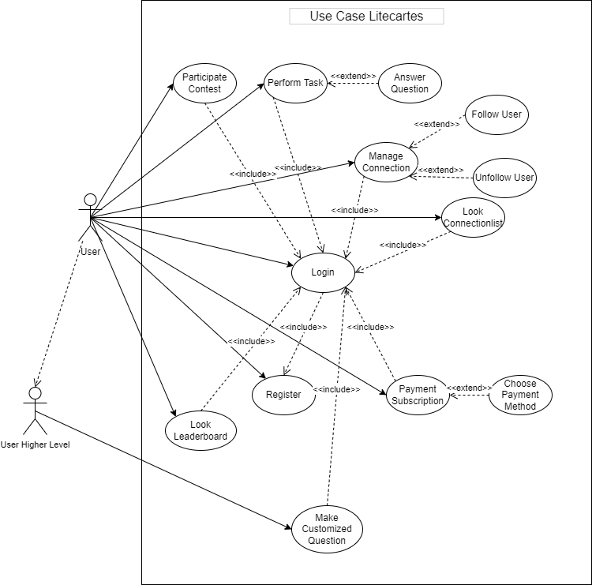
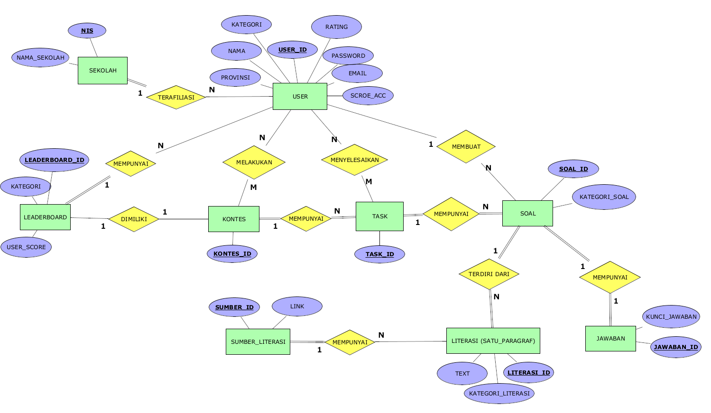

# API Documentation

#### This is Litecartes Backend API Usage Documentatiton. All of the response body only displayed case API successfully proccess the request. Any other than that have almost same structure with different status code and message.
 
### 1. [Usecase Diagram](#usecase-diagram)
### 2. [Entity Relationship Diagram](#entity-relationship-diagram)
### 3. [API Endpoints](#api-endpoints)

## Usecase Diagram


## Entity Relationship Diagram
##### NOTE: not all design are implemented in this api since we had to make some changes to make sure our system is fully integrated with client side


## API Endpoints
### 1. [User](#user)
### 2. [Question](#question)
### 3. [Task](#task)

## User
### 1. Fetch All Users    
Method : ```GET```     
Endpoint : ```/users```   
HTTP Response :    
- ```200 OK```   
- ```500 Internal Server Error```   

#### Query
Field | Datatype | Description | Required |
--- | --- | --- | --- |
limit | integer | rows requested per page | default set to 10
cursor | string | encoded data to navigate page | required to get to next page |
next | boolean | indicating go to previous page if false, go to next page otherwise | default set to true

Response 
```
{
    "status": 200,
    "message": "successfully fech users",
    "data": [
        {
            "uid": "firebase_uniqueid",
            "username": "user",
            "email": "user@gmail.com",
            "subscription_id": 1,
            "school_id": 0,
            "total_exp": 0,
            "gems": 0,
            "streaks": 0,
            "last_active": "2024-01-11",
            "role": "_litecartes-app-user",
            "created_at": 1704987294,
            "updated_at": 1704987294
        }
    ],
    "pagination": {
        "prev_cursor": "eyJjcmVhdGVkX2F0IjoiMjAyNC0wMS0xMiIsInBvaW5fbmV4dCI6ZmFsc2UsImxpbWl0X2RhdGEiOjEwfQ==",
        "next_cursor": "eyJjcmVhdGVkX2F0IjoiMjAyNC0wMS0yMCIsInBvaW5fbmV4dCI6dHJ1ZSwibGltaXRfZGF0YSI6MTB9",
        "limit": 10
    }
}
```

### 2. Fetch User By UID
Method : ```GET```     
Endpoint : ```/users/:uid```  
HTTP Response :    
- ```200 OK```   
- ```500 Internal Server Error```   

Response Body
```
{
    "uid": "firebase_uniqueid",
    "username": "user",
    "email": "user@gmail.com",
    "subscription_id": 1,
    "school_id": 0,
    "total_exp": 0,
    "gems": 0,
    "streaks": 0,
    "last_active": "2024-01-11",
    "role": "_litecartes-app-user",
    "created_at": 1704987294,
    "updated_at": 1704987294
}
```

### 3. Register User
NB : this endpoint will store firebase authenticated user to mysql database, call the API whenever user registered with ```createUserWithEmailAndPassword``` method or ```signInWithGoogle`` once.
Method : ```POST```
Endpoint : ```/users/:uid```   
HTTP Response :    
- ```200 OK```   
- ```404 Not Found```
- ```409 Conflict```
- ```500 Internal Server Error```   

Response Body : 
```
{
    "status": 200,
    "message": "successfully register user"
}
```

### 4. Update User
Method : ```PUT```    
Endpoint : ```/users/:uid```   
Authorized : Right now, the API can be accessed without passing firebase token to header. In the future, we will change it so can only be accessible to authorized user 
HTTP Response :    
- ```200 OK``` 
- ```400 Bad Request```
- ```404 Not Found```
- ```500 Internal Server Error``` 

Json Required Payload  : 
Field | Datatype | 
--- | --- | 
username | string | 
email | string | 
subscription_id | integer | 
school_id | integer | 
total_exp | integer | 
gems | integer | 
streaks | integer | 


Response Body : 
```
{
    "status": 200,
    "message": "successfully update user"
}
```

### 5. Delete User
Method : ```DELETE```    
Endpoint : ```/users/:uid```   
Authorized : Right now, the API can be accessed without passing firebase token to header. In the future, we will change it so can only be accessible to authorized user 
HTTP Response :  
- ```200 OK```
- ```404 Not Found```
- ```500 Internal Server Error```

Response Body :
```
{
    "status": 200,
    "message": "successfully delete user"
}
```

## Question
### 1. Fetch All Question
Method : ```GET```    
Endpoint : ```/questions```    
HTTP Response : 
- ```200 OK```
- ```500 Internal Server Error```  

#### Query
Field | Datatype | Description | Required |
--- | --- | --- | --- |
limit | integer | rows requested per page | default set to 10
cursor | string | encoded data to navigate page | required to get to next page |
next | boolean | indicating go to previous page if false, go to next page otherwise | default set to true

Response Body :

```
{
    "status": 200,
    "message": "successfully fetch questions",
    "data": [
        {
            "uid": "LTC-APP-52485f45-7b6d-4881-ba71-60ab731a2067-QST",
            "category_id": "Pilihan Ganda",
            "task_uid": "",
            "literacy": "big ass text",
            "answer": "A",
            "created_at": "2024-01-14T16:26:01Z",
            "updated_at": "2024-01-14T16:26:01Z"
        }
    ],
    "pagination": {
        "prev_cursor": "eyJjcmVhdGVkX2F0IjoiMjAyNC0wMS0xNCAxNjoyNjowMSIsInBvaW5fbmV4dCI6ZmFsc2UsImxpbWl0X2RhdGEiOjEwfQ==",
        "next_cursor": "eyJjcmVhdGVkX2F0IjoiMjAyNC0wMS0xNCAxNjoyNjowMSIsInBvaW5fbmV4dCI6dHJ1ZSwibGltaXRfZGF0YSI6MTB9",
        "limit": 10
    }
}
```

### 2. Fetch Question By UID
Method : ```GET```  
Endpoint : ```/questions```  
HTTP Response : 
- ```200 OK```
- ```404 Not Found```

Response Body
```
{
    "status": 200,
    "message": "successfully fetch question",
    "data": {
        "uid": "LTC-APP-52485f45-7b6d-4881-ba71-60ab731a2067-QST",
        "category_id": "Pilihan Ganda",
        "task_uid": "",
        "literacy": "big ass text",
        "answer": "A",
        "created_at": "2024-01-14T16:26:01Z",
        "updated_at": "2024-01-14T16:26:01Z"
    }
}
```

### 3. Create Question  
Method : ```POST```   
Endpoint : ```/questions```   
HTTP Response : 
- ```200 OK``` 
- ```500 Internal Server Error```

Json Required Payload  : 
Field | Datatype | required
--- | --- | --- |
category_id | string | yes
task_uid | string | no
literacy | string | yes
answer | string | yes

Response Body : 
```
{
    "status": 200,
    "message": "successfully insert question",
    "data": {
        "uid": "LTC-APP-52485f45-7b6d-4881-ba71-60ab731a2067-QST",
        "category_id": "LTC-APP-generated1",
        "task_uid": "",
        "literacy": "big ass text",
        "answer": "A",
        "created_at": "0001-01-01T00:00:00Z",
        "updated_at": "0001-01-01T00:00:00Z"
    }
}
```

### 4. Update Question  
Method : ```PUT```   
Endpoint : ```/questions/:id```   
HTTP Response : 
- ```200 OK``` 
- ```404 Not Found```
- ```500 Internal Server Error```

Json Required Payload  : 
Field | Datatype | required
--- | --- | --- |
category_id | string | yes
task_uid | string | no
literacy | string | yes
answer | string | yes

Response Body : 
```
{
    "status": 200,
    "message": "successfully update question",
    "data": {
        "uid": "LTC-APP-7e6db33e-82b6-4ccb-b7ae-e54f99585707",
        "category_id": "LTC-APP-generated1",
        "literacy": "big ass holy shieett text",
        "answer": "A",
        "created_at": "0001-01-01T00:00:00Z",
        "updated_at": "0001-01-01T00:00:00Z"
    }
}
```

### 5. Delete Question
Method : ```DELETE```   
Endpoint : ```/questions/:id```   
HTTP Response : 
- ``` 200 OK ```
- ``` 404 Not Found ```
- ``` 500 Internal Server Error```

Response Body 
```
{
    "status": 200,
    "message": "successfully delete question"
}
```
 
## Task

### 1. Fetch All Task
Method : ```GET```   
Endpoint : ```/tasks```    
HTTP Response : 
- ```200 OK```
- ```500 Internal Server Error```

Response Body : 

```
{
    "status": 200,
    "message": "successfully fetch all tasks",
    "data": [
        {
            "uid": "LTC-APP-51830a4e-ede7-4097-8f4c-ba7cfc7a9e94-TSK",
            "level": 1,
            "sign": "number",
            "level_category_id": 1,
            "completed": 0,
            "created_at": "2024-01-14T18:18:53Z",
            "updated_at": "2024-01-14T18:18:53Z"
        }
    ],
    "pagination": {
        "prev_cursor": "eyJjcmVhdGVkX2F0IjoiMjAyNC0wMS0xNCAxODoxODo1MyIsInBvaW5fbmV4dCI6ZmFsc2UsImxpbWl0X2RhdGEiOjEwfQ==",
        "next_cursor": "eyJjcmVhdGVkX2F0IjoiMjAyNC0wMS0xNCAxODoxODo1MyIsInBvaW5fbmV4dCI6dHJ1ZSwibGltaXRfZGF0YSI6MTB9",
        "limit": 10
    }
}
```

### 2. Fetch Task By User UID

Method : ```GET```    
Endpoint : ```/tasks/users/:uid```    
HTTP Response : 
- ```200 OK```
- ```500 Internal Server Error```

Response Body : 

```
{
    "status": 200,
    "message": "successfully fetch tasks by user uid",
    "data": [
        {
            "uid": "LTC-APP-51830a4e-ede7-4097-8f4c-ba7cfc7a9e94-TSK",
            "level": 1,
            "sign": "number",
            "level_category_id": 1,
            "completed": 0, // 0 means not completed yet, 1 means completed task
            "created_at": "2024-01-14T18:18:53Z",
            "updated_at": "2024-01-14T18:18:53Z"
        }
    ],
    "pagination": {
        "prev_cursor": "eyJjcmVhdGVkX2F0IjoiMjAyNC0wMS0xNCAxODoxODo1MyIsInBvaW5fbmV4dCI6ZmFsc2UsImxpbWl0X2RhdGEiOjEwfQ==",
        "next_cursor": "eyJjcmVhdGVkX2F0IjoiMjAyNC0wMS0xNCAxODoxODo1MyIsInBvaW5fbmV4dCI6dHJ1ZSwibGltaXRfZGF0YSI6MTB9",
        "limit": 10
    }
}
```


### 3. Fetch Task With Questions

Method : ```GET```    
Endpoint : ```/tasks/:uid```     
HTTP Response : 
- ```200 OK```
- ```404 Not Found```
- ```500 Internal Server Error```

Response Body : 

```
{
    "status": 200,
    "message": "successfully task with questions",
    "data": {
        "uid": "LTC-APP-51830a4e-ede7-4097-8f4c-ba7cfc7a9e94-TSK",
        "level": 1,
        "sign": "number",
        "level_category_id": 1,
        "completed": 0,
        "questions_list": [
            {
                "uid": "LTC-APP-52485f45-7b6d-4881-ba71-60ab731a2067-QST",
                "category_id": "LTC-APP-generated1",
                "task_uid": "LTC-APP-51830a4e-ede7-4097-8f4c-ba7cfc7a9e94-TSK",
                "literacy": "big ass text",
                "answer": "A",
                "created_at": "2024-01-14T16:26:01Z",
                "updated_at": "2024-01-14T16:26:01Z"
            }
        ],
        "created_at": "2024-01-14T18:18:53Z",
        "updated_at": "2024-01-14T18:18:53Z"
    }
}
```

### 4. Create Task

Method : ```POST```   
Endpoint : ```/tasks```    
HTTP Response : 
- ```200 OK```
- ```409 Conflict```
- ```500 Internal Server Error```

Json Required Payload  : 
Field | Datatype | required
--- | --- | --- |
level | number | yes
sign | string | yes
level_category_id | number | yes

Response Body : 
```
{
    "status": 200,
    "message": "successfully create task",
    "data": {
        "uid": "LTC-APP-3cdb00d4-71b6-4dd8-851b-eefb414a08c6-TSK",
        "level": 1,
        "sign": "number",
        "level_category_id": 1,
        "completed": 0,
        "created_at": "0001-01-01T00:00:00Z",
        "updated_at": "0001-01-01T00:00:00Z"
    }
}
```


### 4. Update Completed Task


Method : ```POST```   
Endpoint : ```/tasks/completed/:taskuid```

Header Required :
| Name | Detail
|-- |--
| Authorization | Firebase Token

Response Body

### 5. Update Task

### 6. Delete Task